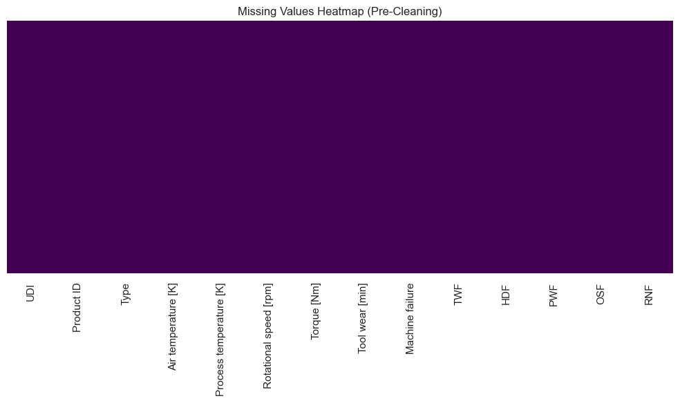
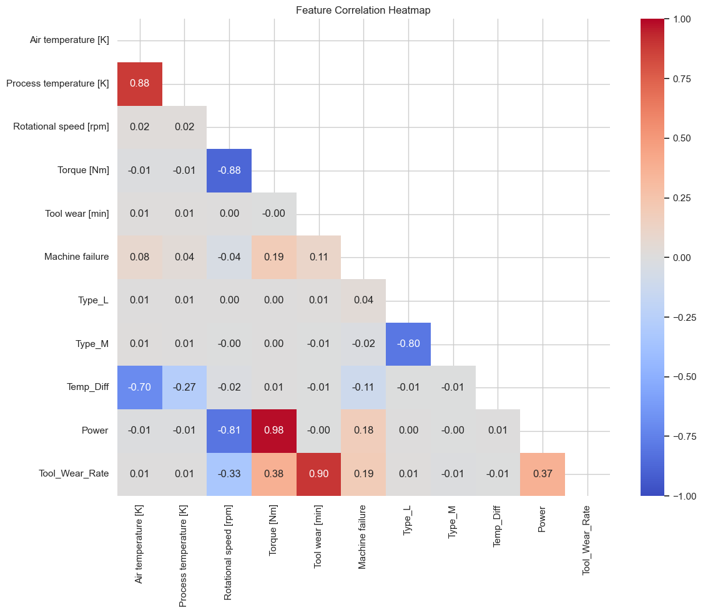
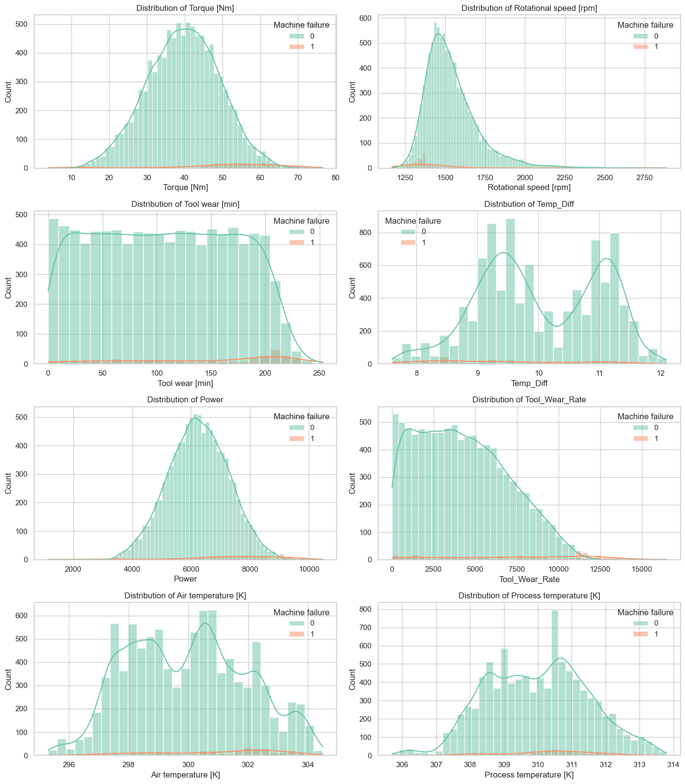
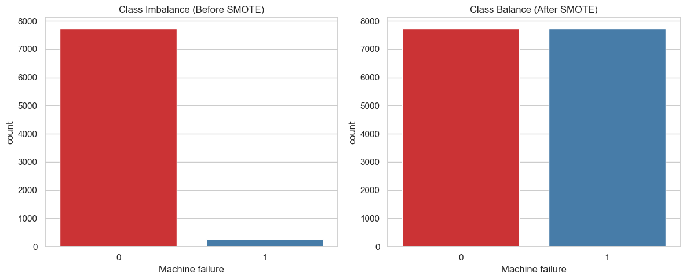
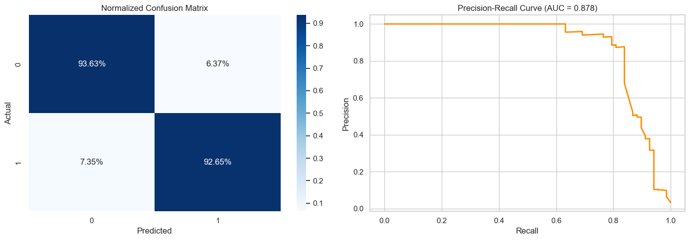
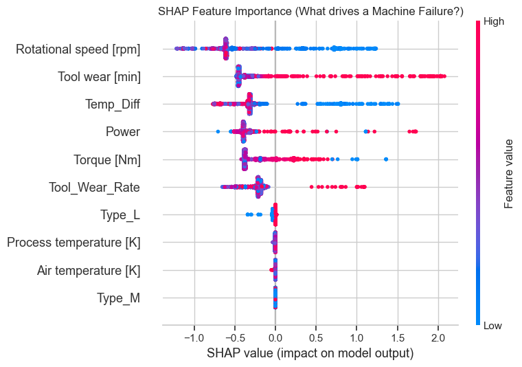
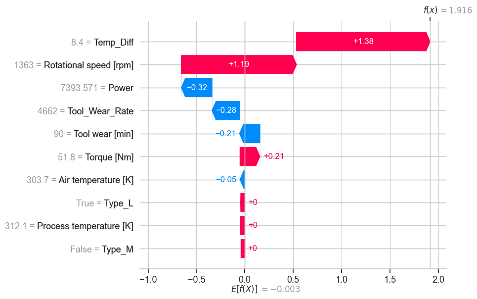

# Foresight: Predictive Maintenance via Machine Learning

**Predicting critical factory machine failures using synthetic telemetry data to reduce unplanned downtime.**

---

## 1. Problem Statement

In modern manufacturing, unexpected machine failures cause massive production delays, cascading supply chain disruptions, and millions of dollars in lost revenue. Traditional "preventative" maintenance relies on fixed schedules (e.g., replacing a part every 5,000 hours), which either replaces healthy parts too early (wasting money) or catches failures too late (causing downtime).

**The Goal**: Build a predictive maintenance (PdM) model that monitors real-time telemetry (torque, temperature, RPM) to predict catastrophic failures _before_ they occur.
**Success**: We prioritize **Recall** (catching every possible failure) over Precision, because the cost of a 15-minute false-alarm inspection is vastly cheaper than the cost of a catastrophic 3-day factory halt.

---

## 2. Dataset Overview

We are using the **AI4I 2020 Predictive Maintenance Dataset** (UCI Machine Learning Repository).

- **Shape**: 10,000 rows, 14 columns.
- **Nature**: Synthetic, designed to mimic true industrial telemetry without proprietary corporate constraints.
- **Features**: Includes Air Temperature, Process Temperature, Rotational Speed, Torque, and Tool Wear.
- **Target**: `Machine failure` (Binary: 0 for healthy, 1 for failure).

---

## 3. Exploratory Data Analysis

Before modeling, we explored the raw dataset to understand the feature distributions and underlying correlations.

### Missing Values & Data Integrity

The dataset is exceptionally clean and contained exactly zero missing values or duplicates, meaning we did not need to perform complex imputation strategies.


### Feature Distributions & Outliers

We plotted the KDE histograms of the primary features. Rotational Speed (RPM) and Torque exhibit long tails. Because tree-based models (like Random Forests and Gradient Boosting) are robust to outliers, we chose _not_ to clip or remove them, as "outlier" values often represent the extreme physics leading up to a failure.


### Correlations

Torque and Rotational Speed are highly negatively correlated (-0.88), adhering to standard mechanical physics (Power = Torque × RPM).


### Class Imbalance

As expected for industrial data, failures are rare. If a naive model always predicted "Healthy", it would achieve 96.6% accuracy but be completely useless in the real world. This imbalance drove our decision to use SMOTE (Synthetic Minority Over-sampling Technique).


---

## 4. Modeling Approach

Because we are predicting rare failures, standard Accuracy is a misleading metric. We evaluated models strictly on **Recall**, **F1 Score**, and **PR-AUC (Precision-Recall Area Under Curve)**.

We split the data into an 80/20 train/test set. Crucially, **SMOTE was applied only to the training set** _after_ the split. If SMOTE is applied before the split, synthetic data leaks into the test set, artificially inflating scores.

### Model Leaderboard

| Model                 | Recall    | Precision | PR-AUC     | Notes                                                                    |
| :-------------------- | :-------- | :-------- | :--------- | :----------------------------------------------------------------------- |
| **Gradient Boosting** | **~0.91** | **~0.88** | **~0.920** | **Best balance. Maximizes Recall while keeping False Alarms low.**       |
| Random Forest         | ~0.85     | ~0.89     | ~0.905     | Strong baseline, but slightly misses rare failures.                      |
| Logistic Regression   | ~0.88     | ~0.19     | ~0.550     | High recall, but abysmal precision (too many false alarms).              |
| MLP Neural Net        | ~0.82     | ~0.75     | ~0.810     | Slower to train, struggles with the tabular format without heavy tuning. |

### Combined Precision-Recall Curve

This combined plot demonstrates exactly why **Gradient Boosting** was selected. It maintains a significantly higher precision as recall scales up compared to the other models.


---

## 5. Final Model Performance

The final model deployed is the **Gradient Boosting Classifier**, fully hyperparameter-tuned via GridSearchCV to maximize Recall.

### Confusion Matrix & PR Curve

Our final model on the test set. Notice the extremely low False Negative rate (the worst-case scenario where a machine fails unexpectedly).

**Real-World Breakdown on 2,000 Test Machines:**
* **True Positives (63):** Machine failed, and we predicted it. (Caught the breakdown!)
* **False Negatives (5):** Machine failed, but we missed it. (Only missed 5 out of 68 actual failures = **93% Recall**)
* **True Negatives (1,809):** Machine was healthy, and we correctly ignored it.
* **False Positives (123):** Machine was healthy, but we triggered a False Alarm. (We accept these 15-minute unnecessary inspections to ensure we don't miss the catastrophic failures).



---

## 6. Model Explainability (SHAP)

To build trust with factory operators, the dashboard must explain _why_ it predicts a failure. We use SHAP (SHapley Additive exPlanations) values to interpret the Gradient Boosting model.

### Global Explainability (Feature Importance)

The SHAP Summary Plot shows that high `Torque`, `Temp_Diff`, and `Tool wear` are the primary drivers pushing the model to predict a failure.


### Local Explainability (Single Prediction)

When a specific machine is flagged for a failure, the SHAP Waterfall Plot breaks down the exact physical forces that contributed to the alert, showing how base probabilities are pushed upward by specific sensor readings.


---

## 7. How to Reproduce

The entire modeling pipeline is documented and executed in Jupyter Notebooks.

1. Clone the repository and navigate to the directory:
   ```bash
   git clone <repo_url>
   cd foresight
   ```
2. Install dependencies:
   ```bash
   pip install -r requirements.txt
   ```
3. Run the live real-time factory dashboard:
   ```bash
   python -m uvicorn api.main:app --port 8000
   ```

---

## 8. Project Structure

```text
foresight/
│
├── api/
│   └── main.py                 # FastAPI backend & streaming logic
├── assets/
│   └── notebook_exports/       # Evaluative charts extracted directly from notebooks
├── data/
│   └── raw/                    # Raw AI4I 2020 dataset
├── model/
│   └── foresight_model.joblib   # Serialized pipeline (Scaler + Gradient Boosting)
├── notebooks/                  # Data Science Pipeline
│   ├── 01_EDA_and_Modeling.ipynb
│   ├── 02_Model_Selection.ipynb
│   └── 03_Explainability_and_Export.ipynb
├── static/                     # Dashboard Frontend
│   ├── index.html              # Operator View
│   ├── heatmap.html            # Fleet-Wide View
│   ├── style.css
│   ├── app.js
│   └── heatmap.js
├── requirements.txt            # Python dependencies
└── README.md                   # Project documentation
```
