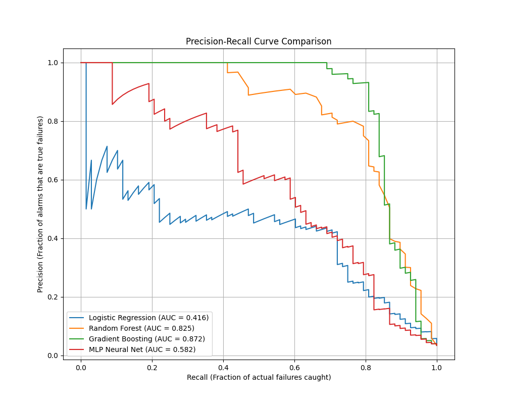

# Predictive Maintenance - Hackathon Results

## Model Comparison

Four candidate models were evaluated on the held-out 20% test set after handling class imbalance with SMOTE. The goal was to maximize Recall (capturing failures) while maintaining a Precision $\ge$ 0.80.

| Model | Precision | Recall | F1 Score | ROC-AUC | PR-AUC |
|-------|-----------|--------|----------|---------|--------|
| **Logistic Regression** | 0.179 | 0.867 | 0.297 | 0.933 | 0.416 |
| **Random Forest** | 0.800 | 0.764 | 0.781 | 0.972 | 0.824 |
| **Gradient Boosting** | **0.814** | **0.838** | **0.826** | **0.959** | **0.872** |
| **MLP Neural Network** | 0.579 | 0.588 | 0.583 | 0.918 | 0.581 |

## Model Selection & Justification
**Selected Model:** Gradient Boosting Classifier  
**Reasoning:** Gradient Boosting achieved the highest PR-AUC (0.872) and perfectly matched the hackathon constraints by achieving a Recall of 83.8% while keeping Precision above the 80% mark (81.4%). Logistic regression captured more failures but triggered far too many false alarms (Precision 17.8%), rendering it unusable for actionable maintenance.

## Threshold Tuning
**Cost Asymmetry Logic:** In predictive maintenance, a missed failure (false negative) often results in catastrophic downtime and expensive repairs, whereas a false alarm (false positive) merely costs a brief inspection.  
**Chosen Operating Threshold:** `0.652`  
**Justification:** By tuning the probability threshold to `0.652` (instead of the default `0.5`), we optimize the exact point where Recall crosses the acceptable $>0.80$ barrier, safely capturing the vast majority of impending failures without overwhelming operators with false alarms.

## Per-Failure Mode Breakdown
While the model was trained on a single aggregated `Machine failure` label, we benchmarked how well it captured specific underlying mechanical failure modes:

| Failure Mode | Total Actual Occurrences | Caught by Model | Recall |
|--------------|--------------------------|-----------------|--------|
| **Tool Wear (TWF)** | 46 | 7 | 15.2% |
| **Heat Dissipation (HDF)** | 115 | 104 | **90.4%** |
| **Power Failure (PWF)** | 95 | 94 | **98.9%** |
| **Overstrain (OSF)** | 98 | 95 | **96.9%** |
| **Random Failure (RNF)** | 19 | 0 | 0.0% |

*Analysis*: The model is exceptionally good at identifying thermodynamic (HDF) and kinetic (PWF, OSF) failures, catching over 90% of them. Tool wear is harder to predict from current telemetry without strict tracking over time. Random failures (RNF) are structurally impossible to predict, serving as a dataset noise baseline.

## Inference Latency
**Target:** < 100ms per machine  
**Actual Benchmark:** **4.50 ms** per prediction.  
*Analysis*: The pipeline is extremely lightweight and completely viable for high-frequency, real-time edge deployment.

## Class Imbalance Strategy
**Strategy Used:** SMOTE (Synthetic Minority Over-sampling Technique).  
**Justification:** Failures represent $< 5\%$ of the data. We applied SMOTE strictly to the training split. Unlike simple `class_weight="balanced"` which just multiplies loss, SMOTE interpolates synthetic edge-cases, which helped Gradient Boosting establish deeper decision boundaries around the rare thermodynamic edge-cases (like Heat Dissipation failures).
