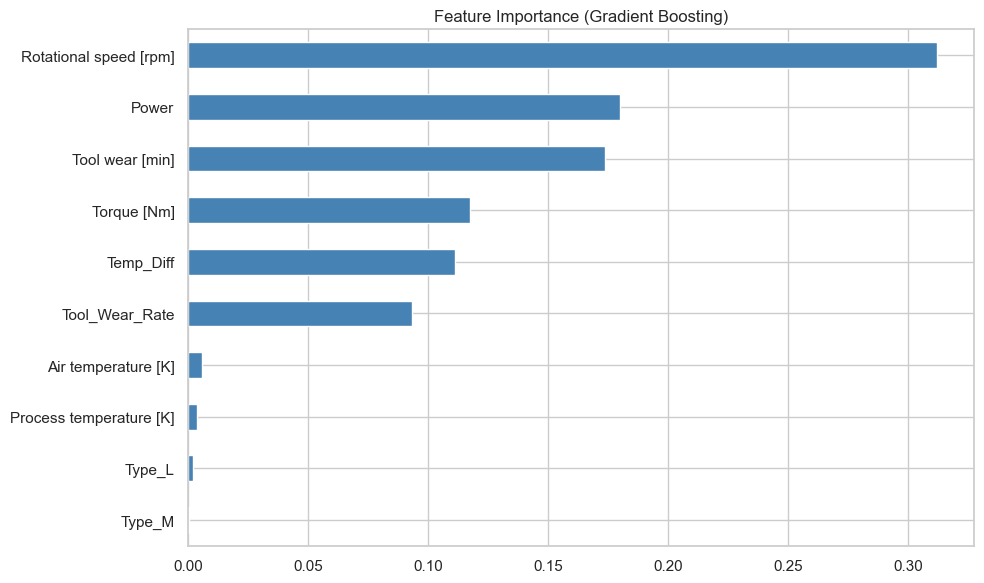
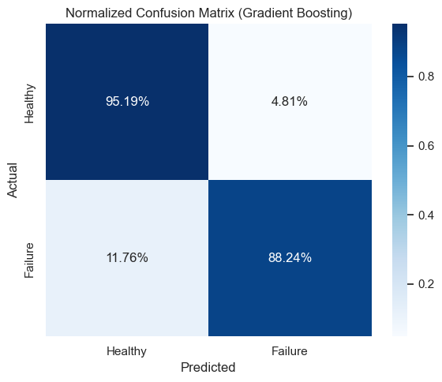

# Foresight: Exploratory Data Analysis & Modeling
This notebook walks through the data cleaning, exploratory analysis, and model training pipeline.


```python
import os
import sys
from pathlib import Path
import pandas as pd
import numpy as np
import matplotlib.pyplot as plt
import seaborn as sns
from sklearn.model_selection import train_test_split, learning_curve
from sklearn.preprocessing import StandardScaler
from sklearn.ensemble import RandomForestClassifier, GradientBoostingClassifier
from sklearn.linear_model import LogisticRegression
from sklearn.metrics import precision_score, recall_score, f1_score, roc_auc_score, auc, precision_recall_curve, roc_curve, confusion_matrix
from imblearn.over_sampling import SMOTE
import matplotlib.patches as patches

# Set clean styling
plt.style.use('seaborn-v0_8-whitegrid')
sns.set_theme(style="whitegrid", palette="muted")
DPI = 150

# Load data
df_raw = pd.read_csv('../data/raw/ai4i2020.csv')
df_raw.head()

```


<div>
<style scoped>
    .dataframe tbody tr th:only-of-type {
        vertical-align: middle;
    }

    .dataframe tbody tr th {
        vertical-align: top;
    }

    .dataframe thead th {
        text-align: right;
    }
</style>
<table border="1" class="dataframe">
  <thead>
    <tr style="text-align: right;">
      <th></th>
      <th>UDI</th>
      <th>Product ID</th>
      <th>Type</th>
      <th>Air temperature [K]</th>
      <th>Process temperature [K]</th>
      <th>Rotational speed [rpm]</th>
      <th>Torque [Nm]</th>
      <th>Tool wear [min]</th>
      <th>Machine failure</th>
      <th>TWF</th>
      <th>HDF</th>
      <th>PWF</th>
      <th>OSF</th>
      <th>RNF</th>
    </tr>
  </thead>
  <tbody>
    <tr>
      <th>0</th>
      <td>1</td>
      <td>M14860</td>
      <td>M</td>
      <td>298.1</td>
      <td>308.6</td>
      <td>1551</td>
      <td>42.8</td>
      <td>0</td>
      <td>0</td>
      <td>0</td>
      <td>0</td>
      <td>0</td>
      <td>0</td>
      <td>0</td>
    </tr>
    <tr>
      <th>1</th>
      <td>2</td>
      <td>L47181</td>
      <td>L</td>
      <td>298.2</td>
      <td>308.7</td>
      <td>1408</td>
      <td>46.3</td>
      <td>3</td>
      <td>0</td>
      <td>0</td>
      <td>0</td>
      <td>0</td>
      <td>0</td>
      <td>0</td>
    </tr>
    <tr>
      <th>2</th>
      <td>3</td>
      <td>L47182</td>
      <td>L</td>
      <td>298.1</td>
      <td>308.5</td>
      <td>1498</td>
      <td>49.4</td>
      <td>5</td>
      <td>0</td>
      <td>0</td>
      <td>0</td>
      <td>0</td>
      <td>0</td>
      <td>0</td>
    </tr>
    <tr>
      <th>3</th>
      <td>4</td>
      <td>L47183</td>
      <td>L</td>
      <td>298.2</td>
      <td>308.6</td>
      <td>1433</td>
      <td>39.5</td>
      <td>7</td>
      <td>0</td>
      <td>0</td>
      <td>0</td>
      <td>0</td>
      <td>0</td>
      <td>0</td>
    </tr>
    <tr>
      <th>4</th>
      <td>5</td>
      <td>L47184</td>
      <td>L</td>
      <td>298.2</td>
      <td>308.7</td>
      <td>1408</td>
      <td>40.0</td>
      <td>9</td>
      <td>0</td>
      <td>0</td>
      <td>0</td>
      <td>0</td>
      <td>0</td>
      <td>0</td>
    </tr>
  </tbody>
</table>
</div>


## 1. Missing Values & Data Integrity


```python
# 1. Missing values heatmap (pre-cleaning)
plt.figure(figsize=(10, 6))
sns.heatmap(df_raw.isnull(), yticklabels=False, cbar=False, cmap='viridis')
plt.title("Missing Values Heatmap (Pre-Cleaning)")
plt.tight_layout()
plt.show()

```


    

    


## 2. Feature Engineering & Preprocessing
We drop identifiers and leakage targets, then engineer physics-based features.


```python
df = df_raw.copy()
df.columns = [c.strip() for c in df.columns]

# Drop UDI and Product ID
df = df.drop(columns=["UDI", "Product ID"])
df = pd.get_dummies(df, columns=["Type"], drop_first=True)

# Feature Engineering
df["Temp_Diff"] = df["Process temperature [K]"] - df["Air temperature [K]"]
df["Power"] = df["Torque [Nm]"] * (df["Rotational speed [rpm]"] * 2 * np.pi / 60)
df["Tool_Wear_Rate"] = df["Tool wear [min]"] * df["Torque [Nm]"]

# Targets to drop to avoid leakage
leakage_cols = ["TWF", "HDF", "PWF", "OSF", "RNF"]
df = df.drop(columns=leakage_cols)

target = "Machine failure"
X = df.drop(columns=[target])
y = df[target]

df.head()

```


<div>
<style scoped>
    .dataframe tbody tr th:only-of-type {
        vertical-align: middle;
    }

    .dataframe tbody tr th {
        vertical-align: top;
    }

    .dataframe thead th {
        text-align: right;
    }
</style>
<table border="1" class="dataframe">
  <thead>
    <tr style="text-align: right;">
      <th></th>
      <th>Air temperature [K]</th>
      <th>Process temperature [K]</th>
      <th>Rotational speed [rpm]</th>
      <th>Torque [Nm]</th>
      <th>Tool wear [min]</th>
      <th>Machine failure</th>
      <th>Type_L</th>
      <th>Type_M</th>
      <th>Temp_Diff</th>
      <th>Power</th>
      <th>Tool_Wear_Rate</th>
    </tr>
  </thead>
  <tbody>
    <tr>
      <th>0</th>
      <td>298.1</td>
      <td>308.6</td>
      <td>1551</td>
      <td>42.8</td>
      <td>0</td>
      <td>0</td>
      <td>False</td>
      <td>True</td>
      <td>10.5</td>
      <td>6951.590560</td>
      <td>0.0</td>
    </tr>
    <tr>
      <th>1</th>
      <td>298.2</td>
      <td>308.7</td>
      <td>1408</td>
      <td>46.3</td>
      <td>3</td>
      <td>0</td>
      <td>True</td>
      <td>False</td>
      <td>10.5</td>
      <td>6826.722724</td>
      <td>138.9</td>
    </tr>
    <tr>
      <th>2</th>
      <td>298.1</td>
      <td>308.5</td>
      <td>1498</td>
      <td>49.4</td>
      <td>5</td>
      <td>0</td>
      <td>True</td>
      <td>False</td>
      <td>10.4</td>
      <td>7749.387543</td>
      <td>247.0</td>
    </tr>
    <tr>
      <th>3</th>
      <td>298.2</td>
      <td>308.6</td>
      <td>1433</td>
      <td>39.5</td>
      <td>7</td>
      <td>0</td>
      <td>True</td>
      <td>False</td>
      <td>10.4</td>
      <td>5927.504659</td>
      <td>276.5</td>
    </tr>
    <tr>
      <th>4</th>
      <td>298.2</td>
      <td>308.7</td>
      <td>1408</td>
      <td>40.0</td>
      <td>9</td>
      <td>0</td>
      <td>True</td>
      <td>False</td>
      <td>10.5</td>
      <td>5897.816608</td>
      <td>360.0</td>
    </tr>
  </tbody>
</table>
</div>


## 3. Correlation Heatmap


```python
plt.figure(figsize=(12, 10))
corr = df.corr()
mask = np.triu(np.ones_like(corr, dtype=bool))
sns.heatmap(corr, mask=mask, annot=True, fmt=".2f", cmap="coolwarm", vmin=-1, vmax=1)
plt.title("Feature Correlation Heatmap")
plt.tight_layout()
plt.show()

```


    

    


## 4. Feature Distributions


```python
top_features = ["Torque [Nm]", "Rotational speed [rpm]", "Tool wear [min]", 
               "Temp_Diff", "Power", "Tool_Wear_Rate", "Air temperature [K]", "Process temperature [K]"]
fig, axes = plt.subplots(4, 2, figsize=(14, 16))
for i, col in enumerate(top_features):
    r, c = i // 2, i % 2
    if col in df.columns:
        sns.histplot(data=df, x=col, hue=target, kde=True, ax=axes[r, c], palette="Set2")
        axes[r, c].set_title(f"Distribution of {col}")
plt.tight_layout()
plt.show()

```


    

    


## 5. Class Imbalance & SMOTE


```python
X_train, X_test, y_train, y_test = train_test_split(X, y, test_size=0.2, random_state=42, stratify=y)
scaler = StandardScaler()
X_train_scaled = scaler.fit_transform(X_train)
X_test_scaled = scaler.transform(X_test)

smote = SMOTE(random_state=42)
X_train_res, y_train_res = smote.fit_resample(X_train_scaled, y_train)

fig, axes = plt.subplots(1, 2, figsize=(12, 5))
sns.countplot(x=y_train, ax=axes[0], palette="Set1")
axes[0].set_title("Class Imbalance (Before SMOTE)")
sns.countplot(x=y_train_res, ax=axes[1], palette="Set1")
axes[1].set_title("Class Balance (After SMOTE)")
plt.tight_layout()
plt.show()

```

    C:\Users\chiklit\AppData\Local\Temp\ipykernel_37900\2527591236.py:10: FutureWarning: 
    
    Passing `palette` without assigning `hue` is deprecated and will be removed in v0.14.0. Assign the `x` variable to `hue` and set `legend=False` for the same effect.
    
      sns.countplot(x=y_train, ax=axes[0], palette="Set1")
    C:\Users\chiklit\AppData\Local\Temp\ipykernel_37900\2527591236.py:12: FutureWarning: 
    
    Passing `palette` without assigning `hue` is deprecated and will be removed in v0.14.0. Assign the `x` variable to `hue` and set `legend=False` for the same effect.
    
      sns.countplot(x=y_train_res, ax=axes[1], palette="Set1")
    


    

    


## 6. Model Training & Evaluation


```python
rf = RandomForestClassifier(n_estimators=100, random_state=42)
gb = GradientBoostingClassifier(random_state=42)
lr = LogisticRegression(max_iter=1000, random_state=42)

rf.fit(X_train_res, y_train_res)
gb.fit(X_train_res, y_train_res)
lr.fit(X_train_res, y_train_res)

# Feature Importance
plt.figure(figsize=(10, 6))
importances = pd.Series(gb.feature_importances_, index=X.columns).sort_values(ascending=True)
importances.plot(kind='barh', color='steelblue')
plt.title("Feature Importance (Gradient Boosting)")
plt.tight_layout()
plt.show()

# Final Model Confusion Matrix
y_pred_gb = gb.predict(X_test_scaled)
cm = confusion_matrix(y_test, y_pred_gb, normalize='true')
plt.figure(figsize=(6, 5))
sns.heatmap(cm, annot=True, fmt=".2%", cmap="Blues", xticklabels=["Healthy", "Failure"], yticklabels=["Healthy", "Failure"])
plt.ylabel("Actual")
plt.xlabel("Predicted")
plt.title("Normalized Confusion Matrix (Gradient Boosting)")
plt.tight_layout()
plt.show()

```


    

    


    

    

